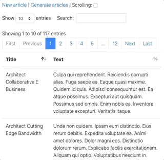

## DataTables Stimulus Wrapper

A [Stimulus](https://github.com/stimulusjs/stimulus) wrapper for
[DataTables](https://datatables.net) under
[Turbolinks](https://github.com/turbolinks/turbolinks).



Here is a zero config example.

```erb
<table id="zero-config" class="table" data-controller="datatable" >
  <thead>
    <tr><th>First</th><th>Last</th></tr>
  </thead>
  <tbody>
    <tr><td>Tenzin</td><td>Gyatso</td></tr>
    <tr><td>Barak</td><td>Obama</td></tr>
    <tr><td>Nelson</td><td>Mandela</td></tr>
  </tbody>
</table>
```

Here is an example of passing the ajax data path from Rails to DataTables.
This uses the [ajax-datatables-rails](https://github.com/jbox-web/ajax-datatables-rails) gem.
It also sets `{ debug: true }` to turn on console logging.

```erb
<table id="ajax-datatable" class="table"
  data-controller="datatable"
  data-datatable-config="<%= {
    debug: true,
    serverSide: true,
    ajax: datatable_articles_path,
    dom: 'lfriptrip',
    stateSave: true,
    columns: [
      {title: 'Title', data: 'title', width: '30%' },
      {title: 'Text', data: 'text', },
    ],
  }.to_json %>"
>
</table>
```

## Setup

Add [ajax-datatables-rails](https://github.com/jbox-web/ajax-datatables-rails) to your Gemfile and follow the data source setup instructions.

```
gem 'ajax-datatables-rails'
```

Add [stimulus-datatables](https://github.com/jgorman/stimulus-datatables)
to package.json and register it with
[Stimulus](https://github.com/stimulusjs/stimulus).


```
yarn add stimulus-datatables
```

```js
// If jQuery is not already registered in window.jQuery do it here.
window.jQuery = window.$ = require('jquery')

// The controller will call: window.jQuery(table).DataTable(config)
require('datatables.net')

// These examples use bootstrap4 and the scroller plugin.
// See https://datatables.net/download for more options.
require('datatables.net-bs4')
require('datatables.net-scroller-bs4')

// Stimulus setup.
import { Application } from 'stimulus'
import { definitionsFromContext } from 'stimulus/webpack-helpers'
const application = Application.start()
const controllers = require.context('../controllers', true, /\.js$/)
application.load(definitionsFromContext(controllers))

// Register the stimulus-datatables controller.
import Datatable from 'stimulus-datatables'
application.register('datatable', Datatable)
```

There appears to be a Datatable problem with long lines not folding
in the scroller plugin. Here is the scss setup for these examples
with the line folding workaround.

```scss
@import 'datatables.net-bs4/css/dataTables.bootstrap4';
@import 'datatables.net-scroller-bs4/css/scroller.bootstrap4.css';

table.dataTable tbody tr td {
  white-space: normal;
}
```

## Advanced Usage

You can make custom stimulus controllers which extend the
standard stimulus datatables controller.

Datatables under Turbolinks triggers extra `initialize()` and `connect()` calls
that are ignored by the controller. The `.DataTable()` call alters the table
element which causes ghost initialization and connect events that need
to be ignored.

When we navigate to a page which is already in the Turbolinks cache,
Turbolinks shows the cached copy as a preview page until
the real page arrives from the server.

There is no point in setting up DataTables for preview pages since we will
need to wait for the ajax call to retrieve the data from the server for
display in the real page.

There are three events that you can customize. `initialize()` sets up the
configuration options. `connect()` starts up DataTables. `teardown()` destroys
the DataTable instance.

When you override `initialize()` and `connect()` you will want to ignore
the ghost events by testing with `this.isBooting()`. See the example below.
`super.initialize()` and `super.connect()` return the config object
while booting and return false for ghost events.

Call `this.log(msg, data)` to write to the console log
to debug custom controller setups. See below for an example.

You can turn on debug messages by setting `{ debug: true }`.
Call `this.debug(msg, data)` to write to console.log only when
`this.config.debug` is true.

```js
import DataTable from 'stimulus-datatables'

export default class extends DataTable {
  initialize() {
    // Ignore ghost events.
    if (!this.isBooting()) return

    // Default settings here will be overridden by component configurations.
    this.config = { pagingType: 'full_numbers', debug: true }

    // Call the super method which gets the component configuration.
    super.initialize()

    // This sets the final config values.
    this.config.dom = 'lfriptrip'
  }

  connect() {
    // Ignore ghost events.
    if (!this.isBooting()) return

    // You can alter the config here before the connect.

    // Call the super method to start up DataTables.
    super.connect()

    // Any post connect actions here.
  }

  teardown() {
    // Any before or after teardown actions. Here we write to console.log.
    this.log('finished', { dt: this })

    // Call the super method to destroy the DataTable instance.
    super.teardown()
  }
}
```

## External Control

Sometimes we will want to make changes to a running DataTables instance.

In order to facilitate this, the DOM table element is linked to its
controller instance: `table.dt`. Each controller instance is
linked back to the DOM table `dt.element`, the `dt.config`, and
the live DataTable API object `dt.dataTable`.

Here is an example of a custom controller which can change state between
scrolling or paging depending on a `#toggle-scrolling` checkbox.
This example is running in the animated gif above.

As the comment mentions, we can reconfigure a DataTable by updating
the config and calling `dt.teardown()`. The teardown process will alter
the DOM element which will trigger a stimulus reconnect with the new config.

Here is the html containing the checkbox and the table.

```erb
<input id="toggle-scrolling" type="checkbox" checked
       data-controller="articles-datatable"
       data-action="change->articles-datatable#toggle_scrolling"
/>

<table id="articles-datatable" class="table"
  data-controller="articles-datatable"
  data-articles-datatable-config="<%= {
    debug: true,
    serverSide: true,
    ajax: datatable_articles_path,
    scroller: true,
    scrollY: 600,
    dom: 'lfriptrip',
    deferRender: true,
    pagingType: 'full_numbers',
    columns: [
      {title: 'Title', data: 'title', width: '30%' },
      {title: 'Text', data: 'text' },
    ],
  }.to_json %>"
>
</table>
```

Here is the custom articles-datatable controller which toggles between
scrolling and paging display modes.

```js
import DataTable from 'stimulus-datatables'

export default class extends DataTable {

  initialize() {
    if (!this.isBooting()) return

    // Link to the scrolling checkbox and back.
    const checkbox = $('#toggle-scrolling')[0]
    if (checkbox) {
      checkbox.dt = this
      this.checkbox = checkbox
    }

    // Get the table config and the scrolling state.
    super.initialize()
    this.setScrollingState()
  }

  toggle_scrolling = event => {
    const dt = this.element.dt
    if (dt) {
      dt.setScrollingState()
      dt.teardown() // This triggers a reconnect.
    }
  }

  setScrollingState = () => {
    const scrolling = this.checkbox && this.checkbox.checked
    const config = this.config || {}
    config.scroller = scrolling
    config.scrollY = scrolling ? 600 : undefined
    config.stateSave = !scrolling
  }
}
```
